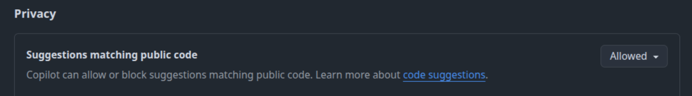

# AI-assisted research software development

**Disclaimer: We try to keep this updated, but due to the pace of developments in the field, we cannot promise that the latest developments have been considered.**

## In the planning and possible solution research phase

- Make sure to visit websites and review documentation of libraries of recommended tools, to check that what the AI promised is actually currently true
- Do not reveal any personal or sensitive information, and possibly use a chat model provided by the URZ or the GWDG

## In the prototyping phase

- Make sure to review and understand the code that the AI is suggesting
- Include docstrings and tests to further clarify specifications and required output
- Indicate the tooling that was used for the creation of the code at least in your Pull Request; some even recommend to include this information in any git commit message as "Generated-by: "

## In the development phase

Same as the prototyping phase, but since we are aiming at a higher maturity of the code, the following applies in addition:
- Do not overrely on the AI - critically inspect if the suggestions are correct. You can ask the AI to find flaws with the proposed approach or ask it to check for specific issues, for example, memory leaks, correct and sufficient type checking, etc.
- Make sure the suggested code follows project standards and conventions and is harmonized with the code base. This is crucially important for maintainability and low technical debt, working towards sustainability goals. 
- Include and frequently run at least unit tests, ideally also testing in continuous integration.
- Include static code analysis such as [SonarCube](https://docs.sonarsource.com/).

## Code review

You have the responsibility for the generated code and should review it carefully. You can also ask the AI to review code critically. You can also iterate roles with the AI, that it suggests code, you refactor the code, and then the AI reviews the code to scan for issues.

## Legal concerns

The underlying models for the AI coding tools were trained on large amounts of open-source libraries. These libraries are published open-source under a certain license. Now the model can reproduce code that exactly matches code in these libraries. It is therefore advisable to verify that generated code does not violate copyright or licenses of code or subject matter that was part of the training data. In practice, this is quite difficult to ensure. GitHub Copilot does have a mode where it will refrain from including suggestions that match public code:

## Ethical use

AI assistance can lead to a large amount of code being produced in a very short time. This is currently referred to as "AI slop". The intentional creation of AI slop is widely considered unethical, due to several factors: (i) The creator is responsible for the content and should aim at the best possible quality; (ii) mass low-quality content can spam and deter from original and high-quality content; (iii) it may create an additional burden on others, that are for some reason forced to consume the content, for example in open-source collaborative work.

It is very easy to include unintentional AI slop: (i) By adding in unrelated changes to the problem that you are currently trying to solve, thus creating an incomprehensive line of development; (ii) by over-reliance on the AI tool for example in the automatic generation of commit messages and Pull Request Summaries.