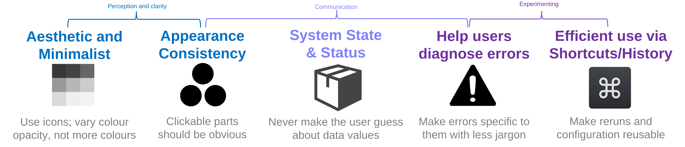

### What is usability for scientific software?
Usable software saves times for new users which can make research proceed faster. Usable software achieves the goal of the user with the execution and interaction of the software mapping and working with their modelling of their scientific domain and what they want to achieve.

More usable software increases productivity of using your software, saves users time to conduct tasks (24% on Desktop in Park et al (2019) for the "Basic Laboratory Information System" software)

Part of user testing is finding **what is confusing the user or frustrating them - these seconds of being unsure or what is unsmooth make an incredible difference for how many people will share and enjoy your software (which helps them recommend it) - they make up the time saving too.**

And especially **for research**, you have the opportunity for you and your users to **build (scientific) social capital*** and become important for moving your field forward faster than it otherwise would, technologically.

### Usability Heuristics
A close-to-timeless resoruce for user interfaces is [Nielsens 10 Usability Heuristics](https://pdfs.semanticscholar.org/5f03/b251093aee730ab9772db2e1a8a7eb8522cb.pdf) (Nielsen, 1998 & 2005), 5 of which are paraphrased below:

### What is design for scientific software?
Design is about prioritising information. WE all struggle with high cognitive load, but bad design or high amounts of visual information in your interface can increase cognitive load (Harper, 2009)

if your application has a view that is too complicated, it will become unusable for new users, which can reduce usage, and design can often benefit it strongly.

We can apply rules to our use of use colour, spacing and information correctness/appearnace on our software is correct and communicates in ways users understand to help make our software more approachable.
Aesthetic appealing software (using consistent colours)  is preferred by observers - important for when people are considering your software or if it should be supported

Design is important for usability because it covers the perception and clarity side. What is unclear we interact with **slower, and with more mistakes**. Improving an application often therefore makes it more usable. Regarding perception, avoiding using old style libraries is also often overlooked by scientists in our experience (e.g. Bootstrap 3 --> Bootstrap 4 for R language applications) (Todo: Example of that)

### How does design have an impact on scientific software?

As well as saving time (Park, 2019) or having economic value, after redesign, scientific software specifically can reduce user errors:
Karlovská et al. (2023), “Redesigning Graphical User Interface of Open-Source Geospatial Software in a Community-Driven Way: A Case Study of GRASS GIS.”
**For software reuse by others to conduct research more efficiently: Could your software be an outstanding resource to increase the pace at which your niche or sub field moves forward?**
To engage with your software, to have the highest potential to sparead, it should be usable.
For **these projects and goals**, dedicate resourcs and prioritise achieving the guidelines here.

Where there is, it is important to consider different angles: Documentation/examples to make starting easier, Design to make understanding information in your software easier, and testing to make better decisions

If the user is not clear on what to do or confused, it takes more cognitive load for them to user your software.
Good usability and aesthetics meaningfully increase user for your application and preference before users have even used it (relevant e.g. for demos, for funding)
Progrmaming well [link to guidelines] and achieving your goals are important.

### Your application should clarify what is important and what the user can do
Design lets you highlight what is key with large size, bold.

when you have less UI elements displayed, you can make space around them so the eye is more drawn to them.

If users are confused, they will abandon your programme earlier.
Really good software has people spreading positive reputation and awareness of you and your lab because of what it clearly does.

### Usability meets design: Take advantage of mapping domain knowledge into the application interface
(Insert graphics here)
Many scientific workflows are naturally processes; put these into steps and **only show the user relevant information for that step**

Leave one clear prominent button only with no other buttons competing for it to proceed to the next step

Note not to take this to the extreme: Consumer applications like Duolingo always have a Next button to entice users to keep using it.
For users wanting to edit options, or as Nielsen mentions, who need a way out of a misstep they have made, having information available("User Control and Information" - Nielsen (1998, updated 2005).
(Todo: want to cite the 2009 M study perhaps that was scientific-software specific)

Lee (2010) showed that both the perception(More the design) of applications and how it is used for the users goal (more the Usability) both matter  - design shapes initial impression and willingness to try a task on your software, and usability influences continued usage. This is why it is important to work on both, and conceptualize them separately.
(todo: This is a large claim I think - not sure:): You should also have designs positive perception benefit in mind for funding applicatiosn

(todo; review this example idea.. try anf find a more visualizable one) A train station can have beautiful signs but if the architect made is so all passengers must go to the further platform from them for their next connection, its bad usability prevents the good design from leading to satisfied passengers)

### The easiest way to achieve this is with a design kit or library. Here are three recommended neutral defaults:

- For web applications: [tailwindcss](https://tailwindcss.com/)
- For R applications: [Shiny](https://shiny.posit.co/)/[bslib](https://rstudio.github.io/bslib/)
- For Python: [Streamlit](https://streamlit.io/)/[dash+mantine](https://www.dash-mantine-components.com/)

For further style there are fashions - for usability in science, it is useful to stick to current defaults.

#### How usability issues grow over time
We don't have a complete picture effect of experience users have. It is easy to possess and expert blindspot and not realize that a few small changes to suit typical ordering
and to categorise and cordon off functionality so it is clear to use the application could make your tool understandable and usable for many people.

- AI in particular when given many additive features can produce them quickly, but lots of visual space clutters the UI and can make it less usable. For example, AI might use several different colours or types of button which contradicts the design guideline and Nielsens Heuristic to have appearance consistently.
- Users feel intimidated by seeing too much content at once, particularly if it is not clear what is important or "first".

#### How you should manage usability/features on an ongoing basis
(Todo: FEature Fatigue point and the "ideal time to redesign" point)

### Advice

#### Make interactive elements clearly discernible by colour or style. (Duplicates above)
Have consistent buttons (Visual needed)

#### Avoid having two of the same "most important button". It is unclear how to proceed. It is disconcerting. (Can remove and add as exmaple by Nielsens heuristics?)
Usually you should use a less primary colour for other interactive parts. Make it always clear for the user how to proceed. Sometimes you truly need to offer two options.

#### Wait until your application data is present to show it all together, cleanly(Not important enough, minor aesthetic):
Loading screens - see Apple loading app example (gaming/UI interfaces)

#### If you lack examples, provide them  to users- onboarding or sample workflow configuration files (Worth keeping, but in workflow one only.)
These give real values they then know work, remove any stress the user has about trying to get their inputs to work, and can illustrate the important parts of the software.
[Read more scientific workflow-specific guidelines](../usability_scientific_workflows/in_complete.md)

### Have a clear system state- for example the current step and checked past steps for multi-step processes. (This is very important, but AI improves it, it is hard and long to explain. Possibly cover in Niels heuristics)

### Using AI: (Plan to remove as not relevant in particular to design)
- Use AI but be careful to keep it as a surface level. Remember AI still suffers from the same problem of adding complexity and in particular can add content linearly,
- or add content which involves scrolling: this can overwhelm users so much and can cause bugs.

### Skills (Not sure if relevant enough, plan to remove for concise content)
You can use skills to achieve some of the above; watching your feature repertoire and managing complexity can help ahead of time; user testing can add the final polish.
[cite skills]
Anthropic Frontend Design skill is designed to avoid common defaults of AI agents

*Scientists contributing workflows did so for Social Capital in Procter (2009)