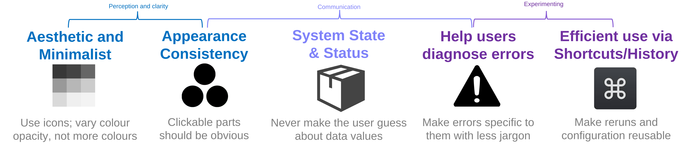
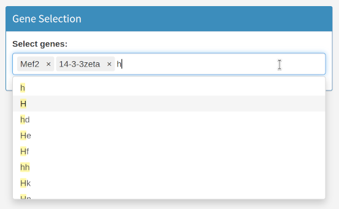
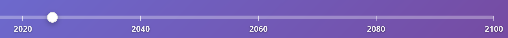
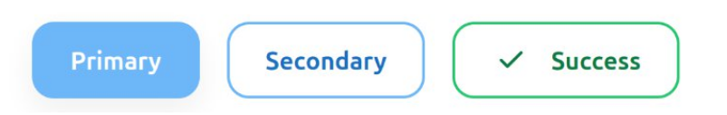

## Usability and Design Guidebook for Scientific Software

Good design increases perception of use, satisfaction and is part of usability. These help your software have more users and weight in your scientific community.

Usability is incredibly important: It determines if your software will have impact, be used by many projects, or can be integrated with other projects for software reuse, and supports reproducibility of your work to be confirmed.

Redesigning your software can **saves users time to conduct tasks** (for example, tasks were completed 24% on Desktop devices in Park et al (2019) for the "Basic Laboratory Information System" software).

Generally we are as users unforgiving to software: if it behaves inconsistently (makes an error or miscalculation) we are reticent to use it ever again, and if we are confused about what to do or what it is showing, we avoid using it. The problem is, the way you use your own software may differ from other users: they may encounter problems you do not as you habitually use your software a certain way; you click button A on screen 1 and then Button H on screen 3 instinctively.

We need to work work on usability and design because we often have expert blindspots to reasons that some users are not using our software.

### What is usability for scientific software?
When the user works how the user expects it to, it is usable. Usability is focusing on making our software easier to understand and operate. Then, if your users really love your software and find it useful, you can push your area of science forward. Usabiltiy is important for science becuase software often harbours hundreds of hours of trial-by-error efforts to work effectively for a paper or lab group, but remains specific and tied to that research, or user unfriendly with bad usability, and so that software goes unused.

[User testing](../user_testing/README.md) includes finding **what is confusing the user or frustrating them** - these seconds of being unsure or what is unsmooth make an incredible difference for how many people will share and enjoy your software (which helps them recommend it). Usability usually means fixing those gaps - whether it is the order of how your software works, the wording it uses, the defaults, the amount of information that is shown at once, or where information is (mis)located on the application.

Different usability techniques apply to extensive/[highly configurable workflow software](../usability_scientific_workflows/README.md) (batch/experiment running/simulating), from other applications (e.g. data exploration/dashboards)

### Usability Heuristics for software
A close-to-timeless resource for user interfaces is [Nielsens 10 Usability Heuristics](https://pdfs.semanticscholar.org/5f03/b251093aee730ab9772db2e1a8a7eb8522cb.pdf) (Nielsen, 1998 & 2005), 5 of which are paraphrased below:

### Our additional advice for scientific-specific usability:
**Autocomplete** with valid options (e.g. genes analyzed in a dashboard graph tool, or [auto-suggesting valid options for a workflow configuration file](../usability_scientific_workflows/README.md#todo)) consistently improve scientific interfaces we work with.
 Above: Provide autocomplete available options

**Provide reactively instantly shown system states**
Do not make the user provide inputs then click submit and wait to see the results, especially for continous data (e.g. climate data over several days)
Let the state and results react to changing the inputs live. Where computationally rapid and cheap, update dependent information instantly upon input changes.

Above: A timeline you can drag allows users to move along data points to see differences in their working memory rather than needing to choose each date.
<!---
better would be a GIF, perhaps of SMART RODENT where one can scroll through each day?
-->

**Provide Documentation/examples to make starting easier**

### What is Design for scientific software?
Design is what you see being clear for you to understand and interact with.
Bad design or high amounts of visual information in your interface can increase cognitive load (Harper, 2009)

if your application has a view that is too complicated, it will become unusable for new users, which can reduce usage, and design can often benefit it strongly.

Using consistent font, borders and variations on colour transparency/brightness with fewer colour hues makes the application **feel more usable**, even if the buttons actions, positions and text content does not change. AI can  often be consistent for each feature you ask, but not for all of them together.

In contrast, do not leave absolutely everything appearing the same way. For example, for buttons - if you hav many buttons avoid solely using text for all buttons. Web applications particularly favour icons, but icons do make sense for very common actions across all software - save floppy disk, folder for files, plus for new help. Grouping buttons together can make their purpose clearer and easier to learn, or using colour with them. Using the icons users know for file/save management helps them focus on the others for actions specific to your software. Likewise, position them where they are expected: Save/load should be on the top left.

Design is important for usability because it covers the perception and clarity side. Unusable/badly design softare makes us **slower, and can lead to more mistakes**, which is why studies like (X) found a 24% time speed up on tasks when redesigning software. It relates to human attention/cognitive psychology: if we see two objects which appear equal we do not know which to focus on, and we prefer to be directed to one over the other.

Even changing from a previous library version to a new library version can increase how many people use your software.

### Design libraries help apply design principles with strong defaults
Design libraries provide consistent components (always the same button "look and feel").

Standard design libraries:
- For web applications: [tailwindcss](https://tailwindcss.com/)
- For R applications: [Shiny](https://shiny.posit.co/)/[bslib](https://rstudio.github.io/bslib/)
- For Python: [Streamlit](https://streamlit.io/)/[dash+mantine](https://www.dash-mantine-components.com/)

### Design libraries also provide structure
Structuring your content is important to make it clear - design libraries typically deal with the pixel-by-pixel location calculations for you:

Above: Page Layouts you can use from [https://shiny.posit.co/r/articles/build/layout-guide/](https://shiny.posit.co/r/articles/build/layout-guide/)

### How does design have an impact on the success of your scientific software and your research impact?

Usability design changes can saving significant time - 24% for one Laboratory software in Park (2019), but as importantly, Karlovská et al. (2023) found that **purely redesigning**  scientific software can reduce user errors.

In terms of awareness, propagating and grant proposals, Lee and Koubek (2010) found that aesthetics affected **preference for simulated applications** before use; after use, both aesthetics and usability mattered. This is why we recommend focusing on **both design(Through design principles) and usability(through [user testing to make improvements](../user_testing/README.md))** when designing software.

(review moving this up)
### Your application should clarify what is important, the unambiguous, clear and correct system state, and what the user can do next
When you have less UI elements displayed, you can make space around them so the eye is more drawn to them. This is best used to break up processes into steps whcih feel more manageable to the user- think duolingo

If the user is not clear on what to do, it takes more cognitive load for them to use your software. Consumer commercial research shows this leads to more early user abandonment.

#### Remember to let users undo and go back from each stage
Provide a consistent "back" or "undo" option so the user does not get into a stuck state (Known as "User Control and Information" - Nielsen (1998, updated 2005)). In user testing this is often where sessions end; users take a route with different habits to you which cause an error (e.g. file format mismatch you never anticipated) or try to use features in an untypical way together, but there is no back way to clear their state to try another route - even if they have a good idea of what they did that was incompatible.

### Managing usability and design - how usability issues grow over time

#### Review if your interface has become too cluterred to understand
`This is most common feedback I give to scientists which makes an immediate difference: Review if the order you added interface objects in on the page matches what the order/layout users expect!` Do you have users expecting to only do the part on the bottom of the page. **Without noticing it**, by adding, we can reduce usability - since we use our software with the same habits, we do not notice this

(Figure here: common vs uncommon buttons + familiar vs unfamiliar location for buttons)

#### Be wary of adding new features at the end of the project
- AI in particular when given many additive features can produce them quickly, but lots of visual space clutters the UI and can make it less usable. For example, AI might use several different colours or types of button which contradicts the design guideline and Nielsens Heuristic to have appearance consistently - but  **Based on actual user reviews, more capabilities does not equal more usability (Thompson et al, 2005)** - the job of UX departments at large software companies is often to delicately communicate which features would reduce the overall usefulness because they make software too complicated - if your software become unusable, consider if you can hide away or delete parts of it.

#### Know that dealing with the amount of features is tied to not exhausting your users working memory - and letting them focus more on using the software for their task
This corresponds directly to uses being intimidated and feeling overwhelmed by seeing too much at once. Showing many inputs and displays is genuine and legitimate for [some scientific software](../usability_scientific_workflows/README.md) so this is not a broad rule but we directly under the cognitive human attention side of it - you are significantly pushing users working memory, especially at the vital time for your softwares proliferation when they first use it and decide whether to keep using your software!

#### Every feature is useful to someone - at some point adding new features decreases overall usability by causing inadvertently complexity
Lee et al., (2006, Figure 3) proposed that adding features initially increases the value and usability of software, but inevitably with more and more features, at some point overall usability ("fitness") can decrease - eventually to states where it harms user use of the software. Repairing these sticky situations of many interconnected feautres by readjusting the interface, and remvoing features could then be more time consuming then having avoided adding and coupling features by adding them without usability/user testing. Macaulay et al (2009) is an example of scientific research using a regular cadence of user testing after each functionality change to achieve higher usability.

Plan usability improvements and user testing mid way in your development to stop excess features too strongly reducing overall usability.

*Scientists contributing workflows were motivated by Social Capital in Procter (2009)