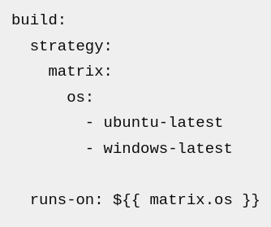
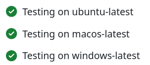

# Guidelines for Scientific software for processes/workflows
These guidelines apply to software which executes scientific tasks which have configuration or require scientific user input to produce scientifc output via data processing.

**Workflow configuration files, such as .yaml files,** can help users declaratively save their workflow configuration in your software for their research, which means the same workflow with the same data can produce the same results later
This saves time Garijo et al (2014) and helps users become comfortable and begin using your software via examples that help them engage with it (Procter, 2009)

## Keep cognitive load low - try to avoid having too much on the screen for any one "task" within your application
- When unsure of layout or order, review existing popular scientific software and use similar approaches to help you decide.
- It can be tempting to say our software is completely novel/unique and invent quite widely; this can work but then try to keep the non-innovative parts/windows standardized.

### Workflow configurations enable more efficient use without confusing users:
In PanSeg, a workflow is created interactively by working through one example input. Each decision gets recorded, and after exporting the result of processing a single file, the user can export a workflow script. This workflow script can then be applied to a whole batch of inputs. This process gives the user confidence in their decisions by providing immediate interactive feedback. Also, the user is guided through the process by taking care which options are visible at what time to not overwhelm them.

Users perceive shared workflow files as useful for learning, and critically, saving time - as reported by 19/21 participants in Garijo et al(2014) and supporting (re)running experiment variations confidently and with auditable input-result pairs.

# Make your Workflow files:
- **Declarative** Save workflow files in human readable formats like `yaml`, with `key:value`s
- **Deterministic**: To support re-use and user confidence, rerunning should generate the same result (outputs should be saved separately to workflow configuration), which is much easier with a single file (Procter et al, 2009)
- **Autocompleteble with valid parameter values** Very simple usability can be sleekily achieved by published JSON schemas for workflow config files - e.g. in the KIMMDY project. This provides incredible usability as Users can see possible valid options and choose them with IDEs link VisualCode + JSON scehma validators

# How to alter you workflow to be usable:
- Hide Advanced Options for workflows is best practise to avoid overwhelming users (Queiroz et al, 2017) - if you show them too many options they cannot comprehend and effectively use them, and sometimes are totally unaware of the best options/feature for their task, see Karlovská (2023) and Procter et al. (2009).
- For example, for PanSeg:
Advanced options irrelevant to most users are hidden behind a toggle, communicating that they can be ignored if one does not understand them. To prevent the user getting stuck with the basic options, the documentation of the advanced options is always linked in each section of PanSeg.
- Provide multiple complete runnable example workflow files to act as documentation. These should express the different capabilities/options that are typical to jump start using your software and function as useful documentation/templates (Procter et al, 2009)

__For multiple workflow files/complex workflows, read about [Cookiecutter](https://github.com/cookiecutter/cookiecutter), cosnider our (C++ template cookiecutter example)[https://github.com/ssciwr/cpp-project-template/actions/runs/28781039589/workflow], and read these [10 rules](https://journals.plos.org/ploscompbiol/article?id=10.1371/journal.pcbi.1010705) principally based on case study workflow software by Roach et al. (2022)__

## Make your software reasonably installable and keep resources accessible
**Can users access your software?:**

As covered in the [general guidelines](../general/README.md), make your research reusable and accessible, use version control and provide user guidance.
- 99% of scientific codebases shared via GitHub links in papers were accessible in a review paper, while only 72% of non Github/SourceForge links were (2000-2017). This paper found this issue is reducing over time, but over 200 papers a year are published with links that by time the researchers checked, were inaccessible over a multi year period (Mangul et al, 2019b)
- --> unless you have a reason not to, consider [GitHub as the place where you save your code](../general/README.md#continuous-integration-ci--continuous-delivery-cd) for others to use 

**Can users install your software?:**
- 49% of scientific software projects were not installable within 15 minutes(Mangul, 2019b)!
- --> **Test Installability itself separately to normal application-use [user tests]**(../user_testing/README.md) **on users or fresh devices**; modern installation techniques can save time. Software people cannot install will not be shared or help you goals, regardless of how much of a step change or benefit it is to the field. .
- --> Run CI tests with different operating systems on such as GitHub which install your package release (e.g. Our SSC C++ [Cookiecutter template has a Github action that tests across operating systems](https://github.com/ssciwr/cpp-project-template/actions/runs/28781039589/workflow)
   