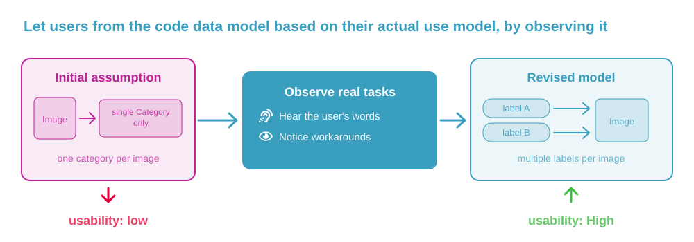
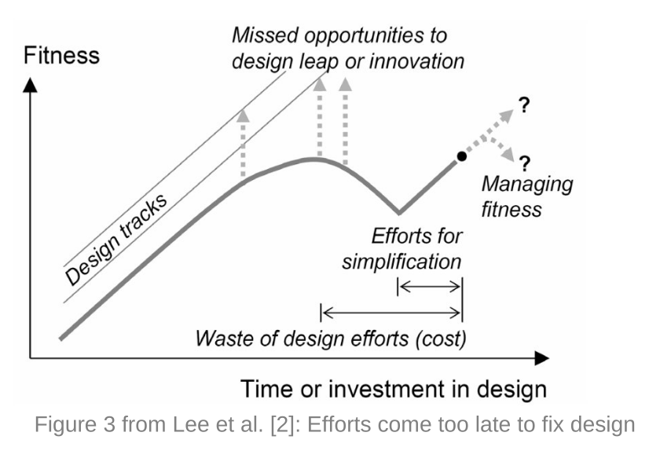

### User testing helps you successfully redesign your application and increase usability

By observing how real users use your software, you can find the points you need to improve (especially beginners)
This can be easier to work with as a scientist than applying design guidelines and create salient points to focus on for your project.

Redesigned software following using testing can help with user productivity: reducing errors and saving time for tasks (Cope et al, 1995).

More than that, more elegant software **designed specifically based upon user interviews and user feedback** makes users feel listened to, like the software matches and models their domain correctly - which moves you from "useful" to "recommendable and reliable". It is very hard for us to recognize inbuilt assumptions (as both more technical creators than the average user and of how we model a domain even as an expert in terms of wording, process assumptions )

If your goal is to spread your application, effective user testing can help you do that.

### How to conduct a user test
- User testing is about selecting people who use the software, and listening to them during and after they have interacted with your real software, or designs.
- Observing and hearing from them can help bring about revelations about the best model for your software to have for your users to achieve their goals. For example, in the OMERO software, user testing by observation and discussion revealed the developers model for an application of "Each image belongs in a category" was wrong - real users wanted to place _labels_ onto each image, not be forced to choose one category. **You should seek these insights/revelations and bring your model closer to the users domain model [to make your software work how they expect to work]** (Macaulay et al, 2009)
- When they test, try and get them to select their own inputs or representative data to see how your software really handles their case (not a tutorial or sample case)

- By doing this you can reveal differences in your conceptualization of the data model vs the users, and adapt your model before you solidify and entangle complex functionality onto it:

Above: Visual representation of the data model change learned from user testing in Macaulay et al (2009)

### How to collect useful information from user testing
- Ask after the test what the worst and best parts were and improve the most common answers.
- Note down the vocabulary you use and where your vocabulary does not match theirs, ask: Should your domain model change, your functionality, or your softwares terminology/wording?
- You can use Likert scales to measure the difference improvements make (e.g. ask them to score satisfaction out of 10 before and after).
- Alternatively, it is easier if you want a numerical metric to see meaningful before/after differences by timing results and seeing if users can operate steps in your software faster. When usability is unclear users pause and take longer.

### How to build user testing into your scientific process/progress
Usability fitness is high for simple initial codebases - if you leave it until the usability of your software is at a breaking point, Lee et. al. (2006) conceputally grounded that it can take more effort to resolve, as seen below.
Running user testing planned in advance you can make efficient productive usability changes (on completion of features, or a cadence such as weekly, see  Macaulay et al (2009) for more specific details)

### How to conduct a user test to improve usability productively:
- Avoid pure discussion about ideas or explaining the application or it's purpose or capabilities to users before tests, including invitation communication.
- Create a Survey and give it to the user after the testing section; have "What did you like" and "What did you dislike" as open text entries
- Observe the time the user spends on tasks, time they spend stuck (and what on) - for small data (realistic for most reserach software), this can be the most qualitative way to have a metric for your usability
- To expand your user base and popularity, speaking to totally new users and less expert users usually helps improve usability and potential usage more than improving it for existing expert users.
- Apply general [design principles and improvements](../usability_and_design/README.md) first - otherwise your feedback will be about general advice you could have applied. Save the user and experts time and feedback for identifying true points of impasse and project-specific issues
